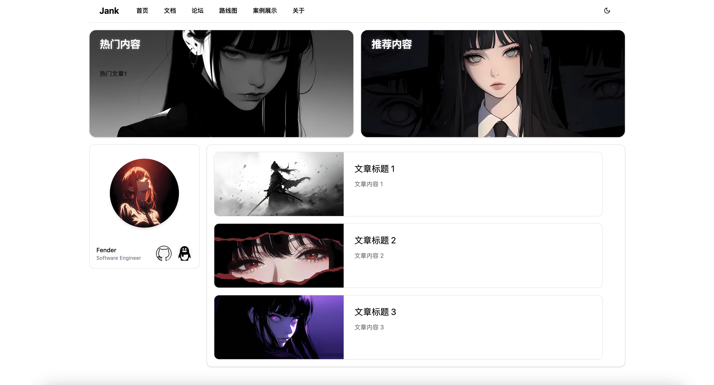
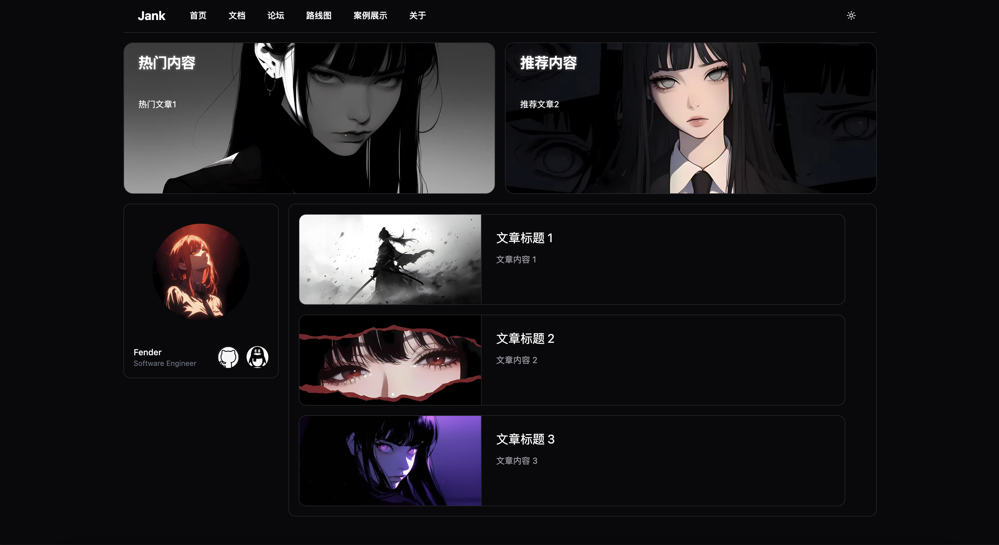

<p style="text-align: center;">
  <a></a>
</p>
<p style="text-align: center;">
  <em>Jank，一个轻量级的博客系统，基于 Go 语言和 Echo 框架开发，强调极简、低耦合和高扩展</em>
</p>
<p style="text-align: center;">
  <a href="https://img.shields.io/github/stars/Done-0/Jank?style=social" target="_blank">
    
  </a> &nbsp;
  <a href="https://img.shields.io/github/forks/Done-0/Jank?style=social" target="_blank">
    
  </a> &nbsp;
  <a href="https://img.shields.io/github/contributors/Done-0/Jank" target="_blank">
    
  </a> &nbsp;
  <a href="https://img.shields.io/github/issues/Done-0/Jank" target="_blank">
    
  </a> &nbsp;
  <a href="https://img.shields.io/github/issues-pr/Done-0/Jank" target="_blank">
    
  </a> &nbsp;
  <a href="https://img.shields.io/github/license/Done-0/Jank" target="_blank">
    
  </a>
</p>
<p style="text-align: center; margin: 0; padding: 0; position: relative; top: -5px;">
  <span style="text-decoration: underline; color: grey;">简体中文</span> | <a href="README_en.md" style="text-decoration: none;">English</a>
</p>

---

Jank 是一个轻量级的博客系统，前端基于 React + Umi + TypeScript + Tailwindcss + Shadcn-ui，后端基于 Go 语言和 Echo 框架开发，设计理念强调极简、低耦合和高扩展，旨在为用户提供功能丰富、界面简洁、操作简单且安全可靠的博客体验。

## 预览




## 技术栈

**后端**：

- **Go 语言**：热门后端开发语言，适合构建高并发应用。
- **Echo 框架**：高性能的 Web 框架，支持快速开发和灵活的路由管理。
- **MySQL**：成熟的关系型数据库管理系统，支持复杂查询和事务处理。
- **Redis**：热门缓存解决方案，提供快速数据存取和持久化选项。
- **JWT**：安全的用户身份验证机制，确保数据传输的完整性和安全性。
- **Docker**：容器化部署工具，简化应用的打包和分发流程。
- **前端**：Vue 3 + Nuxt + Shadcn-vue（原项目已不再维护，诚邀各位前端大佬共同开发）。

**前端**：

- **React**：热门前端开发组件库，提供丰富的组件和功能。
- **Umi**：基于 React 的企业级前端应用框架，提供更高的开发效率。
- **TypeScript**：强类型语言，提供更好的代码提示和开发体验。
- **Tailwindcss**：CSS 框架，提供跨浏览器一致的样式和布局。
- **Shadcn/ui**：基于 React 的 UI 组件集合，提供可复用、易用且美观的组件库。

## 本地开发

> 本项目使用 pnpm 作为包管理工具，请确保有 pnpm 环境。

1. **安装依赖**：

```bash
pnpm install
```

2. **启动服务**：

```bash
pnpm dev
```

4. **访问接口**：
   本地启动应用后，浏览器访问 [http://localhost:3000](http://localhost:3000)

启动成功后，控制台将输出如下信息：

```bash
        ╔════════════════════════════════════════════════════╗
        ║ App listening at:                                  ║
        ║  >   Local: http://localhost:3000                  ║
ready - ║  > Network: http://192.168.0.100:3000              ║
        ║                                                    ║
        ║ Now you can open browser with the above addresses↑ ║
        ╚════════════════════════════════════════════════════╝
```
